<h1 align="center">Sneak Peek</h1>

&emsp;&emsp;&emsp;A Multi-Disciplinary Generalist. Enjoy learning, creating, and solving. But I'm apologize if sometimes I cause problems. Simpleton with complex mind. Build for combat, live for colab. I have many interests, skills, and hobbies. Hang out with a girl is one of 'em (I'm officially certified straight not gay and no sissy). Ofc, i have buddies and secrets (I'm only human afterall). Evaluations are relative, so better face or test me directly (If you dare to know me better).

<h2 align="center">Stack</h2>
<table align="center"><col align="center"><td align="center"><b>Tech</b></td><td align="center"><b>Tools</b></td><td align="center"><b>Games</b></td></col><col align="center"><td align="center">&nbsp;&nbsp;&nbsp;&nbsp; </td><td align="center">&nbsp;&nbsp;&nbsp;&nbsp; &nbsp;&nbsp;&nbsp;&nbsp;</td><td align="center">&emsp;&ensp; <b>Invite Me!</b> 

&nbsp;&nbsp;&nbsp;&nbsp;</td></col></table>

<h2 align="center">Music</h2>
<table align="center"><tr align="center"><td>

[LoFi](https://music.youtube.com/playlist?list=PLe4sSJz8fEMg-E5fxu-FZpgQnih3clC7G)</td><td>[Solon](https://music.youtube.com/playlist?list=PLe4sSJz8fEMh6SPVl-Kt5v6996285UKU_)</td><td>[Alto](https://music.youtube.com/playlist?list=PLe4sSJz8fEMitxzVNgEFAiOb6IKHOsCFE)</td><td>[Dawn](https://music.youtube.com/playlist?list=PLe4sSJz8fEMgBj18kDE34FMdtKmwGiAnU)</td><td>[HEAT](https://music.youtube.com/playlist?list=PLe4sSJz8fEMhE-oZa8xeeak-qNWVIhNU)</td></tr><tr align="center"><td>[Sqeet](https://music.youtube.com/playlist?list=PLe4sSJz8fEMj_cvxN6vbcCIVyshArRsvl)</td><td>[WorkFM](https://music.youtube.com/playlist?list=PLe4sSJz8fEMhphyFrKkqA0-F_60qTXirK)</td><td>[WokeOff](https://music.youtube.com/playlist?list=PLe4sSJz8fEMhQpFJD8qE9pyOAD0xolMtt)</td><td>greystare</td><td>[Candid](https://music.youtube.com/playlist?list=PLe4sSJz8fEMiLoia6WBjiaaI4A6ZKh7TQ)</td></tr></table>

> [!NOTE]\
> Some playlist are private and not mentioned, while some others are incomplete or under some ongoing updates. Stay tune while some changes were made.

<h2 align="center">Goals</h2>

- [ ] Belajar bahasa yg tak dpt dibicarakan
- [ ] Obtain stuff for my work n hobbs
- [ ] 3D print extra limbs and tools
- [ ] Crafting IRL
- [ ] Get a fkin life
- [ ] ~~Conquer the world mwahaha~~ (JK, just doin some batman stuff)
- [ ] Become a great teacher

<h2 align="center"> Love, Life, & Lies</h2>

- Still singlet & verijin
- Open for 19jt loker
- Open for serius rilesyonsip or harem
- Love food & kuking, apalagi traktiran & dikukingin.
- Stargazer, Owl Cat, & Pro Milker
- Outdoor Indoor Gedor aj kidz
- One and only, Misha 🖤🦴
- Kanker ekonomi

<b>Getting Personal?</b>

---
<table align="center"><tr><td align="center"></td><th align="left">Me, Myself & I</th><td align="center">≣</td></tr><tr><td colspan="3"></td></tr><tr align="right"><td colspan="3"></td></tr><tr><td colspan="3"></td></tr><tr align="right"><td colspan="3"></td></tr><tr><td colspan="3"></td></tr><tr><td colspan="3"></td></tr></table>
<h6 align="center"><a href="LICENSE">© 2020 El Roy Situmorang</a></h6>