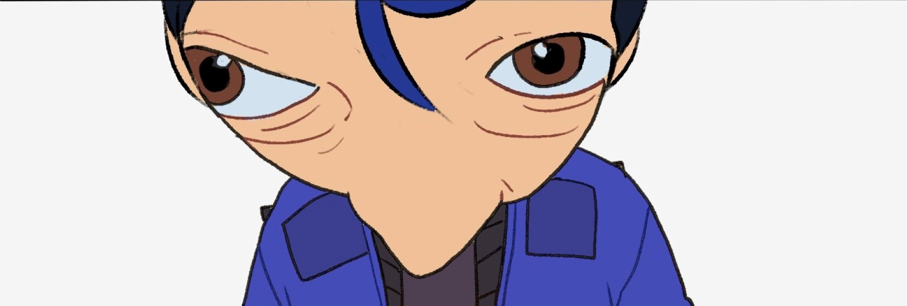

# el-ang
*Welcome visitor!*

 

&emsp;This is my portofolio in the internet. I like games, memes, music, movie, anime, pets, and coding. I'm very good at swimming (and surfing the web), also a little on any sport. I love my mom and her cook. I am noob, slow, and many skill issue. My life is not very good, a bit in the edge of the cliff. I'm not very good at socializing and being discipline, but i'm trying to be better.

&emsp;**Still looking for a job**, because i'm broke. But i'm only *comfortable with part-time job*, because my schedule is a mess and i think i still have less experience that i need to learn more. And i only have months of part-time experience at a small giftshop store.

&emsp;My dream was to become a **President**, but i think i'm just gonna lower it to any kind of president. It's just because i live in a conflictful place, so i want to make a good change and fix all the mess that've been made. I also want to have a *Cafe, my own studio and merch shop*. That's all still a dream, but i'm working on it.

## Things i want to learn
- [x] Coding
- [ ] Robotic & Electronics (20%)
- [ ] Designing (1/2)
- [ ] Drawing (10%)
- [ ] Animating
- [ ] Photography (80%)
- [ ] Videography (10%) (don't have budget :sweat_smile:)
- [ ] Editing (1/2)
- [ ] Fashion (1/2)
- [ ] Skateboard
- [x] Writing (don't have motivation :smiling_face_with_tear:)
- [ ] Language (1/2)
- [ ] Speaking (20%)
- [ ] Music
- [ ] Guitar (1%)
- [ ] Singing (1/2)
- [ ] Dancing (10%)
- [ ] Cooking and drink serving (10%)
- [ ] Self defense (i live in toxic environment and have a harsh polite father :sweat_smile:)
- [ ] Talk to a girl (always a mess :frowning_face:)

## Elses

If you wanna see how far i've learn in coding, ***[here](./knowledge.md)***.

&emsp;I'm a bit perfectionist and it's kinda hard to avoid that. It's also the reason i look a bit primitive and i just want to use my own tools which didn't make me focus on working.

&emsp;Not a religious person, but i don't know when i'm putting my believe in God. Sometimes i just pray you know! It's kinda more personal chat for me with my faith. When i win over something or losing, sometimes there is a time i pray or read some and there is times i forgot it. Even if everyone just gonna keep talking about it, i'm in mute and not in a mood.

&emsp;What kind of male i am? I don't know. I don't really care other thoughts, but i'm trying to be a good man. Acting nice sometimes also made bad thoughts, so i'm sorry if my words or act really hit the spot.

&emsp;I don't really like being obsessive. Even if there is someone come to me that way, i'm just gonna teach them slowly and learn others too. So if there is a girl i liked, i'd rather choose an independent feminist. 'Cause they are more mature, not so often over-ruling, and a nice lovey-dovey companion. It doesn't mean i'd be a soft person but it's helping me to control and assist myself.

&emsp;I hate anything comes with anger, even myself. Please note anger and hype is a different kind of rage. My father bloodline was full of harsh life and rage itself, and i know it just gonna come to me too. I also try too control it, but it's making me mad that my family or someone try to make me so. Because it always put me in the intention to kill something and it's scary. Maybe it was the reason i just let myself become passive and forgiving. What's the point on keep living in the grudge anyway?

Well, i'm sorry if this thing gonna be a diary by the way.