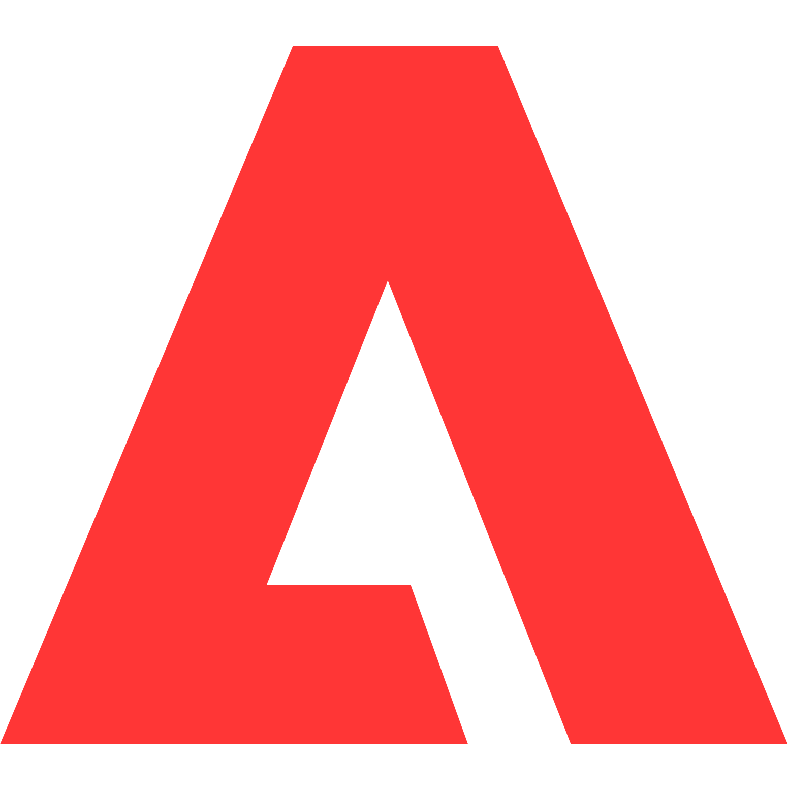
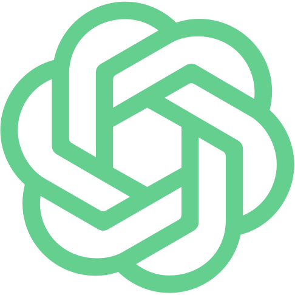

<h1 align=center>ᯂᯬᯒᯘ᯲! El Roy ᯑᯬ ᯎᯬᯀᯒ᯲ᯂᯮ!
</h1>

<b>Problematic&emsp;·&emsp;Hyper Generalist&emsp;·&emsp;Homesick</b> Me? Ehh..? Meh... What do u see in me anyway? ( ¬ ω ¬)

## 🍥 Read Me!

⚡ Creating dreams with <b>CSS, JS, Py, Lua, & Zig</b>.

<!--  -->
<!--  -->

🔥 Grinding XP with creative works, craftings, & mini bosses.

🛹 Solo leveling & evolving to community or studio level.

🧪 Enjoy learning, creating, & solving.

🍜 **Love food & cooking**, apalagi traktiran & dikukingin.
> [!TIP]
> Perceptions may vary. Better meet me in person!
## 🎮 Game On!
✨ Stargazer, Owl Cat, & Energetic.

    &emsp;
    &emsp;
    &emsp;
    &emsp;
    

> **👾 Invite Me!** Outdoor? Indoor? Gedor aj kidz! 👟
&ensp;&ensp;&ensp;&ensp;&ensp;&ensp;
## 🎵 Tune In!
🖤 Misha, One and only

**[LoFi](https://music.youtube.com/playlist?list=PLe4sSJz8fEMg-E5fxu-FZpgQnih3clC7G)&emsp;·&emsp;[Solon](https://music.youtube.com/playlist?list=PLe4sSJz8fEMh6SPVl-Kt5v6996285UKU_)&emsp;·&emsp;[Alto](https://music.youtube.com/playlist?list=PLe4sSJz8fEMitxzVNgEFAiOb6IKHOsCFE)&emsp;·&emsp;[Dawn](https://music.youtube.com/playlist?list=PLe4sSJz8fEMgBj18kDE34FMdtKmwGiAnU)&emsp;·&emsp;[HEAT](https://music.youtube.com/playlist?list=PLe4sSJz8fEMhE-oZa8xeeak-qNWVIhNU)&emsp;·&emsp;[Sqeet](https://music.youtube.com/playlist?list=PLe4sSJz8fEMj_cvxN6vbcCIVyshArRsvl)&emsp;·&emsp;[WorkFM](https://music.youtube.com/playlist?list=PLe4sSJz8fEMhphyFrKkqA0-F_60qTXirK)&emsp;·&emsp;[WokeOff](https://music.youtube.com/playlist?list=PLe4sSJz8fEMhQpFJD8qE9pyOAD0xolMtt)&emsp;·&emsp;greystare&emsp;·&emsp;[Candid](https://music.youtube.com/playlist?list=PLe4sSJz8fEMiLoia6WBjiaaI4A6ZKh7TQ)&emsp;·&emsp;[LOUSY](https://music.youtube.com/playlist?list=PLe4sSJz8fEMi4rynJy8NRmLCn7VWmpgkl)**
> 🎶 **Keep Note!** Some playlists are private and not mentioned, while some others are incomplete or under some ongoing updates. You could stay tune while some changes were made. (^ ω ^ )

<!--
👍 Officially Certified Straight, No Sissy, No Gay, H (Perv), Singlet For Life, & Roger Sumatra.

👀 Open for **serius rilesyonsip** or harem (optional).

💸 **Kanker ekonomi**. Open for 19jt lapak.

## 💯 Goals
- [ ] Belajar bahasa yg tak dpt dibicarakan
- [ ] Get a fkin life (broke af)
- [ ] Obtain stuff for my work n hobbs
- [ ] 3D print extra limbs and tools
- [ ] Crafting IRL (lo-budget)
- [ ] ~~Conquer the world mwahaha~~ (jk, just doin some batman typeshi)
- [ ] Be a great teacher -->

<!-- <h2 align=center>💢 FAQ</h2>
<table align=center><tr><td align=center></td><th align="left">Me, Myself & I</th><td align=center>≣</td></tr><tr><td colspan="3"></td></tr><tr align="right"><td colspan="3"></td></tr><tr><td colspan="3"></td></tr><tr align="right"><td colspan="3"></td></tr><tr><td colspan="3"></td></tr><tr><td colspan="3"></td></tr></table> -->

---

&emsp;&emsp;&emsp;&emsp;
